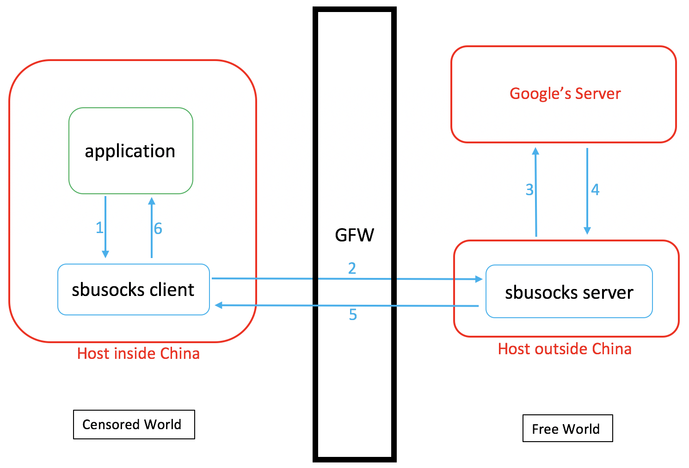

# CSE 534 Project: SBUSocks
## Requirements:
- Python3
- OmegaSwitch for Chrome or Proxifier

## Run Shadowsocks 
### server-side:
```
python server.py config_path
```
The default path of ```config_path``` is ```./server_config.json```

The server configuration contains the following fields
```
    "local_addr":"0.0.0.0",
    "local_port":"xxxx",
    "key":"xxxxxxxxxx"
```
"local_addr":"0.0.0.0" means the server is listening all in-coming IPv4 traffic

"local_port" is the port the server listens on.

"key" is used to generate a key to encrypt and decrypt message between the server and the client.

### client-side:
```
python server.py config_path
```
The default path of ```config_path``` is ```./client_config.json```

The server configuration contains the following fields
```
    "server_addr":"xxx.xxx.xxx.xxx",
    "server_port":"xxxx",
    "local_addr":"127.0.0.1",
    "local_port":"1081",
    "key":"xxxxxxx"
```
"server_addr" is the server IP address.

"server_port" is the server listening port.

"local_addr":"127.0.0.1" means the client is listening all in-coming local IPv4 traffic.

"local_port" is the port the client listens on.

"key" is used to generate a key to encrypt and decrypt message between the server and the client. This key should be the same with the key on the server.


## Use Shadowsocks
We assume applications support socks5 protocol. Chrome with OmegaSwitch extension support socks5. And using Proxifier, we can make all applications support socks5.

The configuration of Omega is as follows:


## Mechanism

SbuSocks' Architecture

Finite-state machine model of client TCP Relay

Finite-state machine model of server TCP Relay

